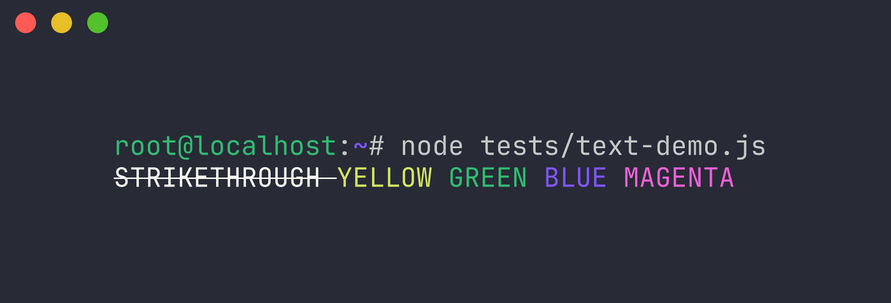

<p align="center">
  
</p>

<p align="center">
  <a href="https://www.npmjs.com/package/inklin">
    
  </a>
  &nbsp;
  <a href="https://www.npmjs.com/package/inklin">
    
  </a>
  &nbsp;
  <a href="https://github.com/sapirrior/inklin/blob/main/LICENSE">
    
  </a>
</p>

# Inklin

Terminal text styling for command-line interfaces.

Inklin provides a chainable API for string styling with support for state-aware style restoration, Truecolor (RGB/Hex), and CLI hyperlinks, within a zero-dependency footprint.

<p align="center">
  
</p>

## Quick Start

### Node.js (ESM/CJS)
```javascript
import inklin from 'inklin';
console.log(inklin.blue.bold('System Initialized'));
```

## Primary Specifications

*   **Zero Runtime Dependencies**: Self-contained implementation.
*   **Module Compatibility**: Support for Node.js (ESM/CJS).
*   **Style Restoration**: State-aware mechanism that handles nested `\x1b[0m` resets.
*   **Automatic Downsampling**: Detects environment capabilities and maps Truecolor to ANSI 256 or 16-color palettes as required.
*   **JIT-Targeted Engine**: Utilizes monomorphic property access for deterministic performance.

## Installation

```bash
npm install inklin
```

## Extended Usage

### Common Use Case: Structured Logging
```javascript
const log = (level, msg) => {
  const styles = {
    info: inklin.blue.bold,
    warn: inklin.yellow.italic,
    error: inklin.bgRed.white.bold
  };
  console.log(`${styles[level](` ${level.toUpperCase()} `)} ${msg}`);
};

log('info', 'Process started.');
log('error', 'Connection failed.');
```

### Style Nesting
Inklin manages the ANSI escape stack to ensure nested styles return to the outer context.

```javascript
console.log(
  inklin.red(`Outer Red ${inklin.blue.bold('Inner Blue Bold')} Outer Red`)
);
```

### Hyperlinks
Generates clickable links in supported terminal emulators.

```javascript
console.log(inklin.link('Repository', 'https://github.com/Sapirrior/inklin'));
```

### Tagged Templates
```javascript
const status = 'Operational';
console.log(inklin.green.bold`System is ${status}.`);
```

## API Reference

| Category | Properties |
| :--- | :--- |
| **Modifiers** | `reset`, `bold`, `dim`, `italic`, `underline`, `inverse`, `strikethrough` |
| **Colors** | `black`, `red`, `green`, `yellow`, `blue`, `magenta`, `cyan`, `white`, `gray` |
| **Brights** | `redBright`, `greenBright`, `yellowBright`, `blueBright`, `magentaBright`, `cyanBright`, `whiteBright` |
| **Backgrounds** | `bgBlack`, `bgRed`, `bgGreen`, `bgYellow`, `bgBlue`, `bgMagenta`, `bgCyan`, `bgWhite`, `bgGray` |

### Methods

*   **`hex(string)` / `bgHex(string)`**: Applies colors via hexadecimal strings (e.g., `#ff0000`).
*   **`rgb(r, g, b)` / `bgRgb(r, g, b)`**: Applies colors via RGB integers (0-255).
*   **`link(text, url)`**: Generates an ANSI hyperlink sequence.
*   **`enable()` / `disable()`**: Toggles global styling state.

## Technical Architecture

Inklin v3.0.1 utilizes a **JIT-Targeted Prototype Architecture** designed for deterministic performance and memory stability.

### Key Implementation Details
*   **Self-Overwriting Getters**: Style properties replace themselves with static references upon first access, maintaining stable hidden classes (shapes) in the V8 engine.
*   **Global Regex Registry**: Manages compiled regular expressions through a centralized cache to ensure a finite memory footprint.
*   **Automatic Capability Detection**: Assesses terminal capabilities to determine the appropriate color fidelity level.

## License

MIT © Sapirrior
